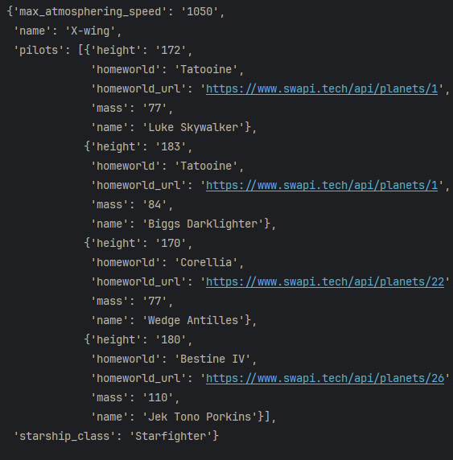
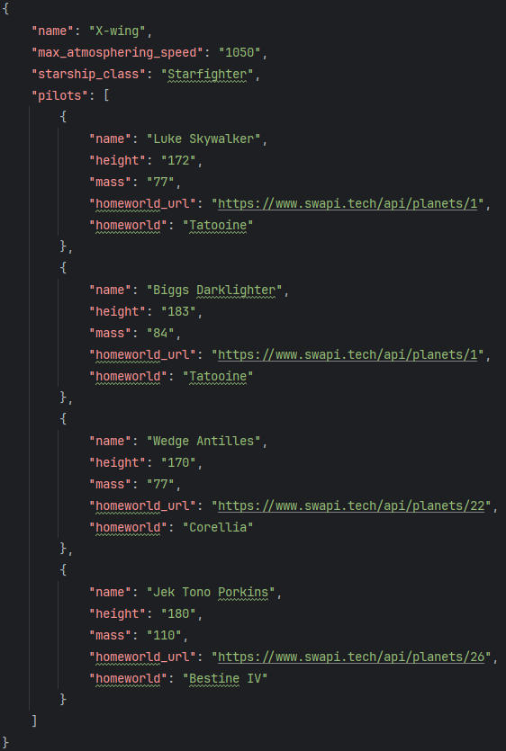

## Задача 3. May the force be with you
### Что нужно сделать
Фанаты «Звёздных войн» (Star Wars) написали API по своей любимой вселенной. Ссылка на документацию: https://www.swapi.tech/documentation

Внимательно изучите документацию этого API и напишите программу, которая выводит на экран (и в JSON-файл) информацию о пилотах легендарного истребителя `X-wing`.  
Информация о корабле должна содержать следующие пункты:
- название,
- максимальная скорость,
- класс,
- список пилотов.

Внутри списка о каждом пилоте должна быть следующая информация:
- имя,
- рост,
- вес,
- родная планета,
- ссылка на информацию о родной планете.

#### Пример вывода информации по кораблю X-wing в консоль:

#### Информация в файле будет выглядеть так:

### Что оценивается

- Результат вычислений корректен.
- Информация собрана в словарь с правильной структурой.
- Переменные, функции и собственные методы классов имеют значащие имена (не a, b, c, d).

